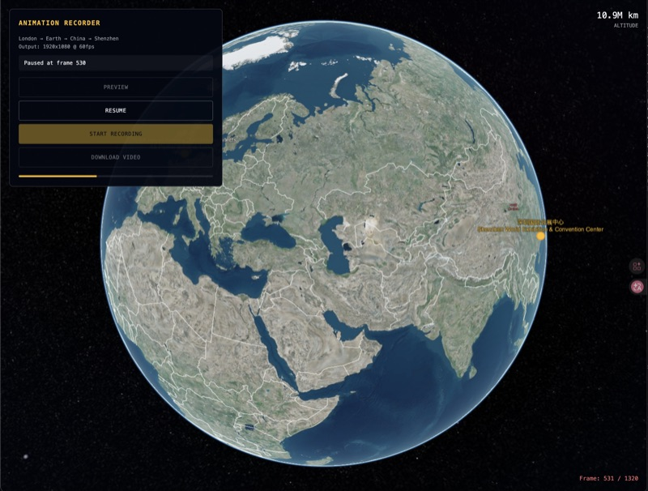

# Earth Journey

Cinematic 3D Earth flight animation from London to Shenzhen with video recording capability.

https://github.com/user-attachments/assets/demo.mp4



## Features

- Smooth camera animation using Catmull-Rom spline interpolation
- Cinematic takeoff and landing with cloud layer effects
- Real-time altitude display
- 1920x1080 @ 60fps video recording
- Pause/resume during preview and recording
- Country borders and location markers
- Deep space nebula background

## Demo

The animation flies from **RIBA (Royal Institute of British Architects), 66 Portland Place, London** to **Shenzhen World Exhibition & Convention Center**.

## Quick Start

### 1. Get a Cesium Ion Access Token

1. Sign up at [Cesium Ion](https://cesium.com/ion/)
2. Go to **Access Tokens** and create a new token
3. Copy your token

### 2. Setup

```bash
# Clone the repository
git clone https://github.com/RuoqiJin/earth-journey.git
cd earth-journey

# Install dependencies
pnpm install

# Create environment file
cp .env.example .env.local

# Edit .env.local and add your Cesium token
# NEXT_PUBLIC_CESIUM_TOKEN=your_token_here

# Start development server
pnpm dev
```

### 3. Open in browser

Visit [http://localhost:3000](http://localhost:3000)

## Usage

1. Click **PREVIEW** to watch the animation
2. Click **START RECORDING** to record the animation as WebM video
3. Click **PAUSE** to pause at any time
4. Click **DOWNLOAD VIDEO** to save the recorded video

## Configuration

### Customize Locations

Edit `src/components/globe/types.ts` to change the start and end locations:

```typescript
export const LOCATIONS: Record<string, Location> = {
  london: {
    lat: 51.5214,
    lon: -0.1448,
    name: '66 PORTLAND PLACE',
  },
  shenzhen: {
    lat: 22.6815,
    lon: 113.839,
    name: 'SHENZHEN WORLD EXHIBITION CENTER',
  },
}
```

### Customize Animation

Modify `ANIMATION_CONFIG` in the same file to change:

- `fps`: Frame rate (default: 60)
- `segments`: Flight path segments with duration and camera positions

## Tech Stack

- [Next.js 16](https://nextjs.org/) - React framework
- [CesiumJS](https://cesium.com/cesiumjs/) - 3D globe rendering
- [Tailwind CSS 4](https://tailwindcss.com/) - Styling
- [TypeScript](https://www.typescriptlang.org/) - Type safety

## Requirements

- Node.js 18+
- Cesium Ion account (free tier works)

## License

MIT
